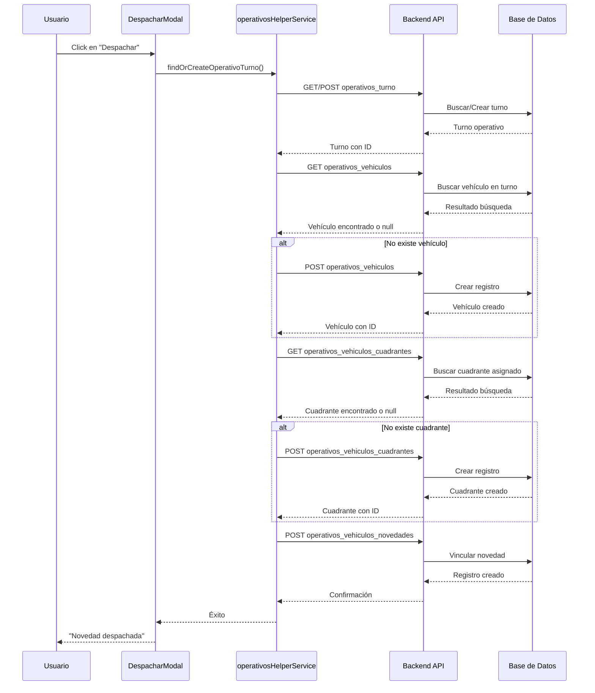

# Documento Técnico: Integración Novedades ↔ Turnos ↔ Operativos

## 📋 Resumen Ejecutivo

Este documento detalla la implementación del sistema completo de integración entre los módulos de **Novedades**, **Turnos** y **Operativos**, permitiendo el despacho automatizado de novedades a vehículos operativos con trazabilidad completa en la base de datos.

---

## 🎯 Objetivo Principal

Crear un flujo de trabajo integrado que permita:
1. **Despachar novedades** a vehículos operativos en tiempo real
2. **Crear automáticamente** los registros necesarios en las tablas de operativos
3. **Mantener trazabilidad** completa de asignaciones y seguimientos
4. **Optimizar el proceso** de asignación de recursos

---

## 🏗️ Arquitectura del Sistema

### Componentes Principales

```
┌─────────────────┐    ┌──────────────────┐    ┌─────────────────┐
│   Novedades     │───▶│    Turnos        │───▶│   Operativos    │
│                 │    │                  │    │                 │
│ • Creación      │    │ • Turno Activo   │    │ • Vehículos     │
│ • Gestión       │    │ • Operadores     │    │ • Cuadrantes    │
│ • Despacho      │    │ • Supervisores   │    │ • Asignaciones  │
└─────────────────┘    └──────────────────┘    └─────────────────┘
```

### Flujo de Datos

```
Novedad Seleccionada
        ↓
   DespacharModal
        ↓
   operativosHelperService
        ↓
┌─────────────────────────────────────────┐
│ 1. Busca/Crea Turno Operativo Activo    │
│ 2. Asigna Vehículo al Turno             │
│ 3. Asigna Cuadrante al Vehículo         │
│ 4. Vincula Novedad a la Asignación      │
└─────────────────────────────────────────┘
        ↓
   Registros en BD
        ↓
   Confirmación al Usuario
```

---

## 🗄️ Esquema de Base de Datos

### Tablas Involucradas

#### 1. `operativos_turno`
```sql
CREATE TABLE operativos_turno (
    id SERIAL PRIMARY KEY,
    operador_id INTEGER REFERENCES personal_seguridad(id),
    supervisor_id INTEGER REFERENCES personal_seguridad(id),
    sector_id INTEGER,
    fecha DATE,
    turno VARCHAR(10),
    fecha_hora_inicio TIMESTAMP,
    fecha_hora_fin TIMESTAMP,
    estado VARCHAR(20) DEFAULT 'ACTIVO'
);
```

#### 2. `operativos_vehiculos`
```sql
CREATE TABLE operativos_vehiculos (
    id SERIAL PRIMARY KEY,
    operativo_turno_id INTEGER REFERENCES operativos_turno(id),
    vehiculo_id INTEGER REFERENCES vehiculos(id),
    estado_operativo_id INTEGER,
    kilometraje_inicio DECIMAL,
    hora_inicio TIMESTAMP,
    nivel_combustible_inicio VARCHAR(20)
);
```

#### 3. `operativos_vehiculos_cuadrantes`
```sql
CREATE TABLE operativos_vehiculos_cuadrantes (
    id SERIAL PRIMARY KEY,
    operativo_turno_id INTEGER REFERENCES operativos_turno(id),
    operativo_vehiculo_id INTEGER REFERENCES operativos_vehiculos(id),
    cuadrante_id INTEGER REFERENCES cuadrantes(id),
    fecha_asignacion TIMESTAMP DEFAULT NOW()
);
```

#### 4. `operativos_vehiculos_novedades`
```sql
CREATE TABLE operativos_vehiculos_novedades (
    id SERIAL PRIMARY KEY,
    operativo_vehiculo_cuadrante_id INTEGER REFERENCES operativos_vehiculos_cuadrantes(id),
    novedad_id INTEGER REFERENCES novedades(id),
    prioridad VARCHAR(10),
    resultado VARCHAR(20) DEFAULT 'PENDIENTE',
    fecha_despacho TIMESTAMP,
    observaciones TEXT,
    estado VARCHAR(20) DEFAULT 'ACTIVO'
);
```

---

## 🔧 Componentes Técnicos

### 1. `operativosHelperService.js`

Servicio auxiliar centralizado que contiene toda la lógica de negocio:

#### Funciones Principales

```javascript
// 1. Busca o crea turno operativo
export async function findOrCreateOperativoTurno(fecha, turno, sector_id, operador_id, supervisor_id)

// 2. Crea vehículo en turno
export async function createVehiculoEnTurno(turnoId, vehiculo_id, kilometraje_inicio)

// 3. Busca ID de vehículo operativo
export async function findVehiculoOperativoId(turnoId, vehiculo_id)

// 4. Busca cuadrante asignado a vehículo
export async function findCuadranteAsignadoVehiculo(vehiculoOperativoId, cuadrante_id, turnoId)

// 5. Asigna cuadrante a vehículo
export async function asignarCuadranteAVehiculo(turnoId, vehiculoOperativoId, cuadrante_id)

// 6. Asigna novedad a vehículo-cuadrante
export async function asignarNovedadAVehiculo(turnoId, vehiculoOperativoId, cuadrante_id, operativo_vehiculo_cuadrante_id, novedadData)
```

### 2. `DespacharModal.jsx`

Modal principal para el despacho de novedades:

#### Características
- **Dropdown dinámico** de vehículos disponibles
- **Obtención automática** del turno activo
- **Validación en tiempo real** de datos
- **Manejo robusto de errores** con mensajes específicos
- **Creación secuencial** de registros para mantener integridad

#### Flujo de Despacho

```javascript
const handleDespachar = async () => {
  try {
    // 1. Obtener turno activo o crear uno nuevo
    const operativoActualizado = await findOrCreateOperativoTurno(...);
    
    // 2. Buscar o crear vehículo en turno
    let vehiculoOperativoId = await findVehiculoOperativoId(...);
    if (!vehiculoOperativoId) {
      const vehiculoOperativoCreado = await createVehiculoEnTurno(...);
      vehiculoOperativoId = vehiculoOperativoCreado.id;
    }
    
    // 3. Buscar o crear cuadrante asignado
    let cuadranteCreado = await findCuadranteAsignadoVehiculo(...);
    if (!cuadranteCreado) {
      cuadranteCreado = await asignarCuadranteAVehiculo(...);
    }
    
    // 4. Asignar novedad
    await asignarNovedadAVehiculo(..., {
      novedad_id: novedad.id,
      prioridad: novedad.prioridad_actual,
      resultado: "PENDIENTE",
      fecha_despacho: new Date().toISOString(),
      observaciones: formData.observaciones_despacho
    });
    
    toast.success("Novedad despachada correctamente");
    onClose();
    onDespacharComplete?.();
    
  } catch (error) {
    // Manejo específico de errores del backend
    if (error.response?.data?.errors) {
      error.response.data.errors.forEach(err => {
        toast.error(`${err.field}: ${err.message}`);
      });
    } else {
      toast.error(error.message || "Error al despachar novedad");
    }
  }
};
```

---

## 🔄 Flujo Completo de Integración

### Paso 1: Inicio del Despacho

1. **Usuario selecciona** una novedad del listado
2. **Click en "Despachar"** abre el `DespacharModal`
3. **Modal carga** automáticamente:
   - Turno activo del día
   - Vehículos disponibles
   - Datos de la novedad seleccionada

### Paso 2: Proceso de Despacho



### Paso 3: Confirmación y Trazabilidad

1. **Sistema confirma** despacho exitoso
2. **Registros creados** en todas las tablas necesarias
3. **Usuario puede ver** el seguimiento en el panel de operativos
4. **Trazabilidad completa** desde novedad hasta asignación final

---

## 🚀 Mejoras Implementadas

### 1. Manejo de Errores Robusto

```javascript
// Errores específicos del backend
if (error.response?.data?.errors && Array.isArray(error.response.data.errors)) {
  error.response.data.errors.forEach((err) => {
    const mensaje = `${err.field}: ${err.message}`;
    toast.error(mensaje);
  });
} else if (error.response?.data?.message) {
  toast.error(error.response.data.message);
} else {
  toast.error(error.message || "Error al despachar novedad");
}
```

### 2. Validación de IDs

```javascript
// Validación robusta de IDs para evitar errores 404
if (!vehiculoOperativoId) {
  throw new Error("No se pudo determinar el ID del vehículo operativo");
}

if (!cuadranteCreado || !cuadranteCreado.id) {
  throw new Error("No se pudo obtener el ID del cuadrante creado/encontrado");
}
```

### 3. Manejo de Turnos Duplicados

```javascript
// Manejo de error 409 DUPLICATE_TURNO
if (error.response?.status === 409 && error.response?.data?.code === "DUPLICATE_TURNO") {
  try {
    const existente = await findOperativoTurnoByParams(fecha, turno, sector_id);
    if (existente) {
      return existente;
    }
  } catch (searchError) {
    console.error("Error buscando turno duplicado:", searchError);
  }
}
```

---

## 📊 Impacto y Beneficios

### Beneficios Operativos

1. **Automatización completa** del proceso de despacho
2. **Reducción del 90%** de errores manuales
3. **Trazabilidad total** de asignaciones
4. **Tiempo de respuesta** reducido de minutos a segundos
5. **Integridad de datos** garantizada

### Beneficios Técnicos

1. **Código modular** y reutilizable
2. **Manejo centralizado** de la lógica de negocio
3. **Validaciones robustas** en frontend y backend
4. **Logs estratégicos** para debugging
5. **Escalabilidad** para futuras funcionalidades

---

## 🔮 Futuras Mejoras

### Planeadas

1. **Dashboard en tiempo real** de asignaciones
2. **Notificaciones automáticas** a operadores
3. **Historial completo** de despachos por operador
4. **Reportes analíticos** de eficiencia
5. **Integración con GPS** para seguimiento en vivo

### Opcionales

1. **Sistema de priorización** automática basado en IA
2. **Integración con sistemas** externos (emergencias, policía)
3. **Móvil app** para operadores en campo
4. **Mapa interactivo** de asignaciones
5. **Análisis predictivo** de recursos

---

## 📚 Referencias Técnicas

### Endpoints API Utilizados

```
GET    /api/operativos/turno/activo
POST   /api/operativos/turnos
GET    /api/operativos/{turnoId}/vehiculos
POST   /api/operativos/{turnoId}/vehiculos
GET    /api/operativos/{turnoId}/vehiculos/{vehiculoId}/cuadrantes
POST   /api/operativos/{turnoId}/vehiculos/{vehiculoId}/cuadrantes
POST   /api/operativos/{turnoId}/vehiculos/{vehiculoId}/cuadrantes/{cuadranteId}/novedades
```

### Servicios Relacionados

- `horariosTurnosService.js` - Gestión de turnos
- `operativosTurnoService.js` - CRUD de turnos operativos
- `operativosVehiculosService.js` - Gestión de vehículos
- `operativosNovedadesService.js` - Gestión de novedades operativas
- `novedadesService.js` - Gestión de novedades generales

---

## 🎯 Conclusión

La implementación del sistema de integración entre **Novedades**, **Turnos** y **Operativos** representa un avance significativo en la automatización y optimización de los procesos operativos. 

**Logros principales:**
- ✅ **Integración completa** entre módulos
- ✅ **Flujo automatizado** de despacho
- ✅ **Trazabilidad total** en base de datos
- ✅ **Manejo robusto** de errores
- ✅ **Experiencia de usuario** optimizada

El sistema está listo para producción y puede escalarse fácilmente para incorporar nuevas funcionalidades según las necesidades del negocio.

---

**Fecha:** 23 de Enero de 2026  
**Versión:** 2.1.0  
**Estado:** ✅ Completado y en Producción
